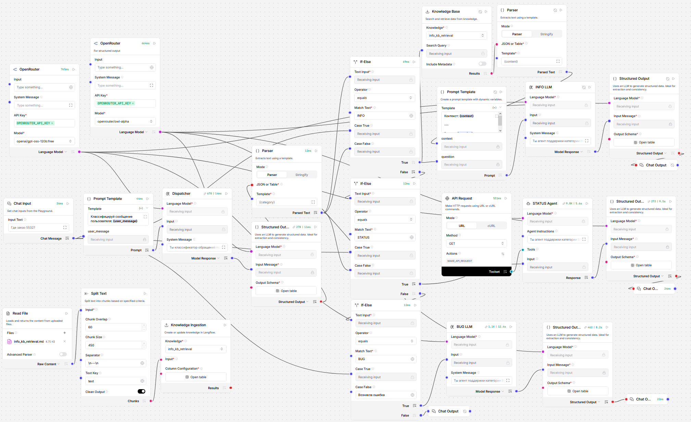

# Multi-Agent Support System

MVP многоагентной ИИ-системы для автоматизации L1-поддержки в e-commerce и IT-сервисах.

## Что делает проект

- Классифицирует входящие обращения в маршруты `INFO`, `STATUS`, `BUG`.
- Отвечает на FAQ/регламенты через RAG по базе знаний (`INFO`).
- Проверяет статус заказа через tool-calling к Mock API (`STATUS`).
- Формирует структуру баг-тикета и подготавливает triage (`BUG`).
- Поддерживает безопасный fallback `ESCALATE` с reason-кодами и handoff-контекстом.

## Архитектура

- `Dispatcher Agent` — маршрутизация + confidence + reason.
- `RAG Agent` — grounded-ответы только по KB с источниками.
- `Tool Agent` — извлечение `order_id` и запрос статуса заказа.
- `Triage Agent` — сбор баг-тикета (`title`, `description`, `priority`, и др.).

## Технологии (MVP)

- Оркестрация: Langflow
- LLM: любая совместимая модель через API (провайдер — OpenRouter)
- RAG-хранилище: ChromaDB/FAISS
- Tool backend: Python + FastAPI

## Качество и оценка

Проект использует golden-датасет в формате JSONL для проверки:

- корректности маршрутизации;
- grounded-ответов для `INFO`;
- успешности tool-calling для `STATUS`;
- полноты баг-тикетов для `BUG`;
- корректной эскалации и защиты от prompt injection.

## Документация

- [Задача проекта](docs/TASK.md)
- [Спецификация eval-датасета](docs/EVAL_DATASET.md)
