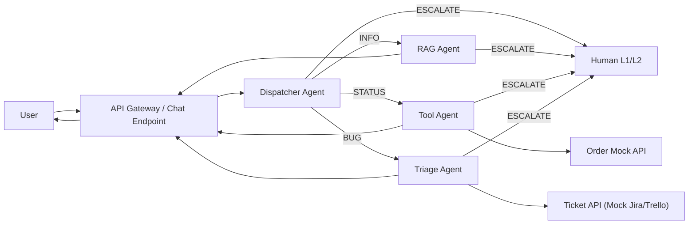

# Multi-Agent Support System — Architecture

## 1. Назначение документа

`ARCHITECTURE.md` фиксирует архитектуру MVP из `TASK.md` на уровне компонентов, контрактов, потока выполнения и наблюдаемости, чтобы:

1. Быстро объяснить систему на демо и собеседовании.
2. Упростить реализацию в Langflow + FastAPI.
3. Снизить риск неоднозначной интерпретации требований.

## 2. Архитектурный подход

Паттерн: **Router / Dispatcher + специализированные агенты**.

Причина выбора:

1. Разделение ответственности между ветками `INFO`, `STATUS`, `BUG`.
2. Простая масштабируемость (добавление новых категорий через Router).
3. Прозрачный аудит решений (reason/confidence/trace).

## 3. Контекст системы



## 4. Компоненты и ответственность

| Компонент | Ответственность | Ключевые входы | Ключевые выходы |
|---|---|---|---|
| API Gateway / Chat Endpoint | Прием/выдача сообщений, trace init | `user_id`, `message`, metadata | normalized request, final response |
| Dispatcher Agent | Классификация запроса | текст пользователя | `category`, `confidence`, `reason` |
| RAG Agent | Ответы по KB без галлюцинаций | `message`, retrieved chunks | `answer`, `sources`, `grounded` |
| Tool Agent | Проверка статуса заказа | `message` | `order_id`, `raw_status`, `answer` |
| Triage Agent | Формирование баг-тикета | `message`, optional logs | ticket payload + post result |
| Order Mock API | Источник статуса заказа | `order_id` | JSON статуса заказа |
| Ticket API | Прием баг-тикетов | ticket JSON | `ticket_id`/status |
| Observability | Логи, метрики, trace | events from all stages | dashboards/test reports |

## 5. E2E-поток обработки

1. Gateway принимает сообщение и создает `trace_id`.
2. Dispatcher классифицирует обращение: `INFO | STATUS | BUG`.
3. Router отправляет запрос в ветку.
4. Ветка формирует финальный ответ или `ESCALATE`.
5. Gateway возвращает ответ пользователю и пишет финальный лог события.

## 6. Внутренние потоки по веткам

### 6.1 INFO (RAG)

1. Выполнить retrieval top-k по KB.
2. Если контекст найден: сгенерировать grounded-ответ со ссылками на chunk.
3. Если no-hit: вернуть `ESCALATE` с `reason_code=NO_KB_HIT`.

### 6.2 STATUS (Tool)

1. Извлечь `order_id` (LLM + regex fallback).
2. Если `order_id` отсутствует: уточнить у пользователя.
3. Вызвать `GET /order/{order_id}`.
4. При успехе: сформировать пользовательский ответ.
5. При timeout/5xx: вернуть `ESCALATE` с `reason_code=TOOL_FAILURE`.

### 6.3 BUG (Triage)

1. Проверить полноту входных данных (симптом, шаги, expected/actual).
2. Если данных мало: задать уточняющие вопросы.
3. Сформировать ticket payload.
4. Отправить в mock ticket API.
5. При ошибке интеграции: `ESCALATE` с `reason_code=TOOL_FAILURE`.

## 7. Контракты интеграций

### 7.1 Order API

- `GET /order/{order_id}`
- Успех:

```json
{
  "order_id": "5532",
  "status": "shipped",
  "eta": "2026-05-18"
}
```

- Ошибки:

1. `404` — заказ не найден.
2. `422` — невалидный формат order_id.
3. `503` — сервис временно недоступен.

### 7.2 Ticket API

- `POST /ticket`
- Тело:

```json
{
  "title": "Промокод не применяется на шаге оплаты",
  "description": "Ошибка при вводе кода SAVE10",
  "priority": "Medium",
  "repro_steps": "1) Добавить товар 2) Перейти к оплате 3) Ввести SAVE10",
  "expected": "Скидка 10%",
  "actual": "Появляется ошибка 500"
}
```

- Ответ:

```json
{
  "ticket_id": "SUP-204",
  "status": "created"
}
```

## 8. ESCALATE-политика

`ESCALATE` возвращается, если:

1. Низкая уверенность маршрутизации.
2. Подозрение на prompt injection/policy risk.
3. Нет релевантного контекста в KB.
4. Интеграции недоступны или возвращают критическую ошибку.

Формат:

```json
{
  "action": "ESCALATE",
  "reason_code": "LOW_CONFIDENCE | POLICY_RISK | NO_KB_HIT | TOOL_FAILURE",
  "reason": "string",
  "handoff_payload": {
    "summary": "string",
    "collected_context": "string"
  }
}
```

## 9. Наблюдаемость и логирование

Минимальный лог-событие на шаг:

```json
{
  "trace_id": "uuid",
  "session_id": "string",
  "thread_id": "string",
  "timestamp": "ISO-8601",
  "agent": "dispatcher|rag|tool|triage",
  "event": "start|decision|tool_call|final|error|escalate",
  "latency_ms": 123,
  "decision": "INFO",
  "confidence": 0.91,
  "error_code": null
}
```

Рекомендуемые метрики:

1. Routing accuracy.
2. Grounded answer rate.
3. Tool success rate.
4. Ticket completeness rate.
5. Escalation rate.
6. P50/P95 latency.

## 10. Безопасность и guardrails

1. Allowlist инструментов для tool-calling.
2. Маскирование PII в логах.
3. Игнорирование инструкций пользователя, конфликтующих с системными правилами.
4. Запрет на возврат внутренних промптов/секретов.

## 11. Performance budget (MVP)

1. `p95` end-to-end latency <= `5s` (mock integrations).
2. `p95` dispatcher latency <= `1s`.
3. `p95` tool-api call <= `1.5s`.

## 12. Решения для будущих итераций

1. Добавить категорию `PAYMENT`.
2. Ввести confidence calibration на golden-set.
3. Подключить реальный ticketing backend.
4. Добавить human-in-the-loop UI для L1.
